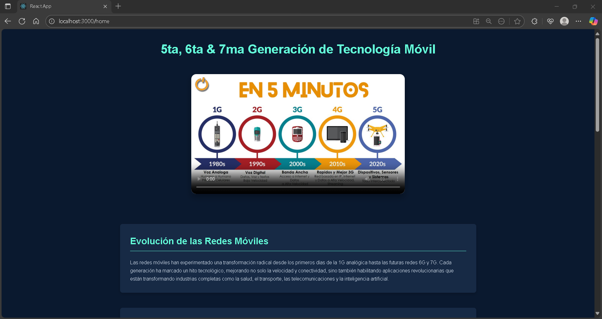

## 📘 Project Description

This document presents a technical overview of a robust **polyglot backend architecture** built using both **Node.js** and **Python**, integrated through a shared **MySQL database**. The system is designed to support **user authentication, authorization, and user management** within a scalable cloud-based environment hosted on **AWS infrastructure**.

The backend follows modular principles to separate concerns between services, allowing seamless integration, easier maintenance, and high scalability. It supports API communication between frontend and backend layers, and includes secure data handling practices for production-ready deployment.

---

### 🔧 Key Features

- 🌐 **Hybrid Backend (Node.js + Python):** Combines the strengths of both platforms for specific microservices and task handling.
- 🔐 **Authentication & User Management:** Secure login, session handling, and role-based access control.
- ☁️ **AWS Cloud Deployment:** Optimized for scalability, availability, and deployment automation.
- 💾 **Shared MySQL Database:** Centralized relational storage for consistent data access across services.
- 🛠️ **Modular Architecture:** Promotes reusability and simplifies development and scaling.

---

### 📂 Explore the System

- **Core Application Components** – Architecture, services, and API responsibilities.  
- **Development Infrastructure** – Tools, environment setup, and build pipelines.  
- **Dependencies and Libraries** – External modules and frameworks used in the backend stack.

  
Click the badge to explore full documentation and development insights via **DeepWiki**.

---

### 🖼️ System Overview

